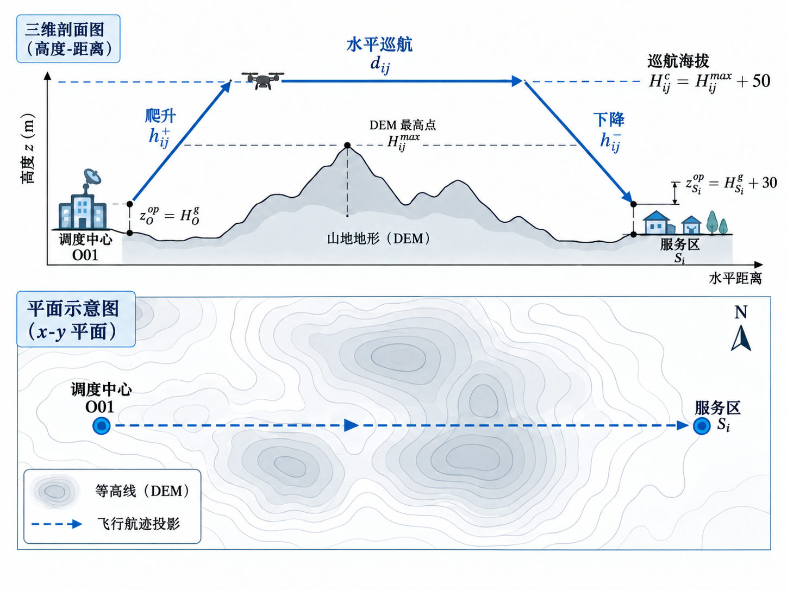
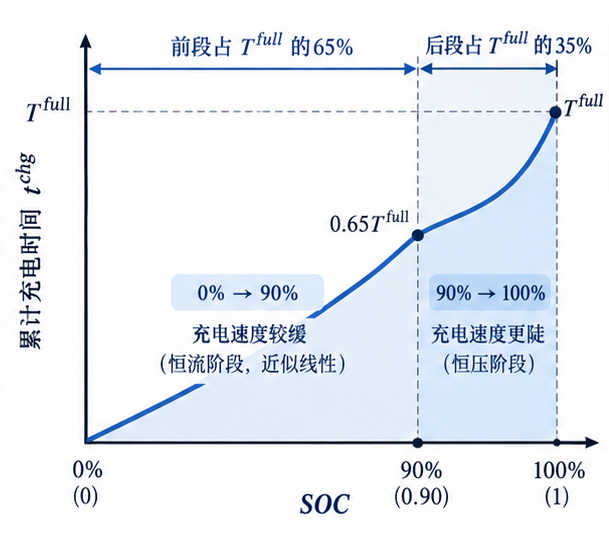
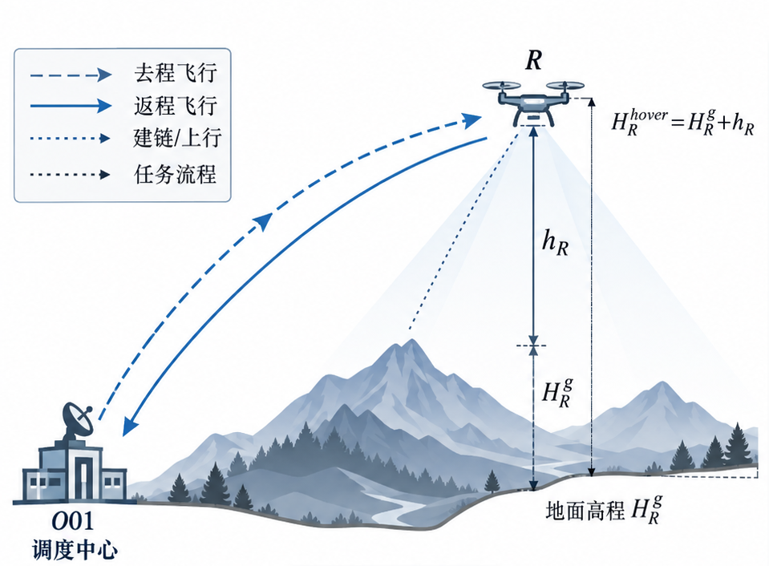
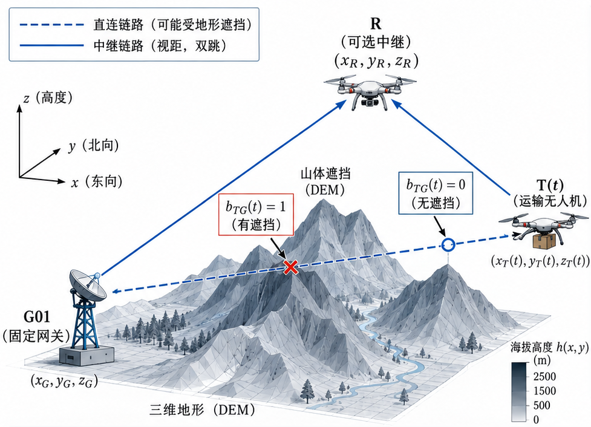
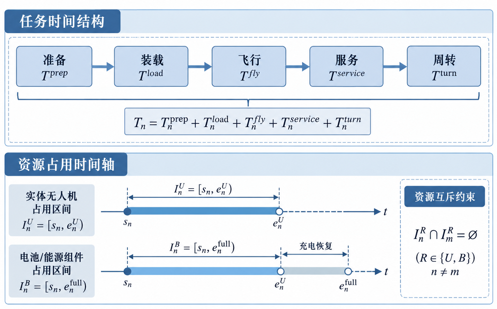

# 4. 基本模型

山区洪涝灾害下的无人机救援任务同时受到地形、载荷、能源和通信条件的约束。不同研究阶段关注的决策对象有所不同，但无人机的航迹高度、飞行时间、能源消耗等均服从同一物理规律。
为此，我们首先建立无人机调度基本模型。后文涉及的运输任务、中继任务及资源配置均在该基本模型给出的物理可行域内进行，同时运输航段采用任务节点间水平直线，巡航海拔由沿途 DEM 最高高程确定，同时运输及中继能源资源均需考虑 SOC 与充电周转。

## 4.1 基于 DEM 的三维飞行航段模型

### 4.1.1 水平航段与地形高程模型

为便于统一计算实际距离，将调度中心及各服务区域的经纬度坐标进行单位转换。首先将各节点由 WGS-84 地理坐标转换至局部高斯平面坐标系，设节点 \(i\) 和节点 \(j\) 的平面坐标分别为

\[
P_i=(x_i,y_i),\qquad P_j=(x_j,y_j),
\]

则两节点间的水平飞行距离为

\[
d_{ij}
=
\sqrt{(x_i-x_j)^2+(y_i-y_j)^2}.
\tag{4-1}
\]

其中，\(d_{ij}\) 的单位为 m。

在山区环境中，仅根据起终点海拔确定巡航高度会忽略航段中间的山脊等高地，因此需要进一步结合 DEM 栅格确定航段所经过的最高地形。记水平线段 \(P_iP_j\) 穿过的 DEM 像元集合为

\[
\mathcal C_{ij}
=
\left\{
c:
c\text{ 与线段 }P_iP_j\text{ 相交}
\right\},
\tag{4-2}
\]

像元 \(c\) 对应的地形高程记为 \(H_c\)，则该航段所经过区域的最大地面高程为

\[
H_{ij}^{\max}
=
\max_{c\in \mathcal C_{ij}} H_c.
\tag{4-3}
\]

无人机在水平巡航阶段应始终保持在所经过最高地形以上 \(50\rm\,m\)，故航段 \(i\rightarrow j\) 的计划巡航海拔为

\[
H_{ij}^{c}
=
H_{ij}^{\max}+50.
\tag{4-4}
\]

式（4-3）将连续的山地地形约束转化为了有限 DEM 栅格上的最大值问题，使飞行时间、爬升能耗以及通信视距计算统一建立在同一地形基础上，运输航段采用节点间水平直线，并依据原始 DEM 计算沿线最高地形。

### 4.1.2 节点作业高度

无人机在调度中心和服务区的作业高度不完全相同。设节点 \(i\) 的地面海拔为 \(H_i^{g}\)。调度中心 \(O01\) 的作业高度取其地面海拔，即

\[
H_{O}^{op}=H_O^{g},
\tag{4-5}
\]

服务区 \(S_i\) 的物资投送作业高度为地面以上 \(30\rm\,m\)，即

\[
H_{S_i}^{op}=H_{S_i}^{g}+30.
\tag{4-6}
\]

由此，对任一飞行航段 \(i\rightarrow j\)，起飞后的爬升高度可写为

\[
h_{ij}^{+}
=
H_{ij}^{c}-H_i^{op},
\tag{4-7}
\]

下降高度为

\[
h_{ij}^{-}
=
H_{ij}^{c}-H_j^{op}.
\tag{4-8}
\]

因此，一个完整运输航段可统一表示为爬升、水平巡航、下降三个连续阶段。对于连续访问多个节点的任务，每完成一次物资投送后，无人机均回到当前服务区的作业高度，下一航段再重新爬升。

### 4.1.3 航段飞行时间

设机型 \(g\) 的爬升速度、水平巡航速度和下降速度分别为

\[
v_g^{\uparrow},\qquad
v_g^{c},\qquad
v_g^{\downarrow}.
\]

根据三阶段航迹结构，航段 \(i\rightarrow j\) 的飞行时间可以分解为

\[
t_{gij}
=
t_{gij}^{\uparrow}
+
t_{gij}^{c}
+
t_{gij}^{\downarrow},
\tag{4-9}
\]

其中

\[
t_{gij}^{\uparrow}
=
\frac{h_{ij}^{+}}{v_g^{\uparrow}},
\qquad
t_{gij}^{c}
=
\frac{d_{ij}}{v_g^{c}},
\qquad
t_{gij}^{\downarrow}
=
\frac{h_{ij}^{-}}{v_g^{\downarrow}}.
\tag{4-10}
\]

从而得到

\[

t_{gij}
=
\frac{h_{ij}^{+}}{v_g^{\uparrow}}
+
\frac{d_{ij}}{v_g^{c}}
+
\frac{h_{ij}^{-}}{v_g^{\downarrow}}
\tag{4-11}
\]

飞行航段模型原理如下图所示。

## 4.2 载荷相关航程与运输能耗模型

无人机的实际续航能力会随载荷增加而下降。如果忽略载荷变化，则多点投送过程中前后各航段会被赋予相同能耗水平，因此我们建立载荷相关的运输能耗模型。

### 4.2.1 载荷相关等效航程

设运输无人机机型为 \(g\)，其额定最大载质量为 \(Q_g\)，空载标准航程为 \(L_g^0\)，满载标准航程为 \(L_g^F\)。当当前有效载荷为 \(q\) 时，题目给出的载荷相关等效航程可写为

\[

L_g(q)
=
L_g^0-
\left(L_g^0-L_g^F\right)
\left(\frac{q}{Q_g}\right)^{3/2}
\tag{4-12}
\]

其中

\[
0\le q\le Q_g.
\]

由式（4-12）可直接得到两个边界条件

\[
L_g(0)=L_g^0,
\qquad
L_g(Q_g)=L_g^F.
\tag{4-13}
\]

由于通常满足

\[
L_g^0>L_g^F,
\]

因此随着 \(q\) 增大，\(L_g(q)\) 单调下降，即无人机载荷越大，同一组电池能够支持的等效水平飞行距离越短。

### 4.2.2 水平巡航能耗

由于载荷相关等效航程与单组电池可用能量已知，但没有给出水平巡航能耗和爬升附加能耗的计算关系。为将上述参数统一转化为可计算的航段能耗，我们根据等效航程的物理含义建立如下能耗折算关系。

设机型 \(g\) 单组电池的可用能量为 \(E_g^{use}\)。在载荷为 \(q\) 时，如果无人机利用全部可用能量能够完成的等效水平航程为 \(L_g(q)\)，则单位水平距离平均所需能量为

\[
e_g^{hor}(q)
=
\frac{E_g^{use}}{L_g(q)}.
\tag{4-14}
\]

于是飞行水平距离 \(d_{ij}\) 所需的巡航能耗为

\[
E_{gij}^{hor}(q)
=
e_g^{hor}(q)d_{ij},
\]

即

\[

E_{gij}^{hor}(q)
=
E_g^{use}
\frac{d_{ij}}{L_g(q)}
\tag{4-15}
\]

式（4-15）的含义十分直接：当

\[
d_{ij}=L_g(q)
\]

时，有

\[
E_{gij}^{hor}(q)=E_g^{use},
\]

即在该载荷条件下飞完整个等效航程恰好消耗一组电池的全部可用能量。

### 4.2.3 爬升附加能耗

无人机爬升过程中需要克服重力做功。设机型 \(g\) 的含电池空载质量为 \(m_g^0\)，当前携带载荷为 \(q\)，则爬升阶段总质量为

\[
m_g(q)=m_g^0+q.
\tag{4-16}
\]

当无人机爬升高度为 \(h_{ij}^{+}\) 时，理论重力势能增量为

\[
\Delta E_p
=
m_g(q)gh_{ij}^{+},
\tag{4-17}
\]

其中

\[
g=9.80665\ {\rm m/s^2}.
\]

考虑到实际动力系统存在能量转换损失，设爬升效率为 \(\eta_g^{up}\)，则电池需要输出的能量为

\[
E_{gij}^{up,J}(q)
=
\frac{
(m_g^0+q)gh_{ij}^{+}
}{
\eta_g^{up}
}.
\tag{4-18}
\]

式（4-18）的单位为 J。利用

\[
1\ {\rm kWh}
=
3.6\times10^6\ {\rm J},
\]

可得以 kWh 为单位的爬升附加能耗：

\[

E_{gij}^{up}(q)
=
\frac{
(m_g^0+q)gh_{ij}^{+}
}{
3.6\times10^6\eta_g^{up}
}
\tag{4-19}
\]

由式（4-19）可知，爬升能耗同时随飞行总质量与爬升高度增加。当航段中途存在较高山脊时，式（4-4）使巡航海拔升高，并进一步通过式（4-7）增加爬升高度，因此 DEM 地形条件会间接影响无人机能耗。

### 4.2.4 航段总能耗

由于下降阶段不单独计附加能耗，因此一个运输航段的总能耗由水平巡航能耗和爬升附加能耗组成：

\[
E_{gij}(q)
=
E_{gij}^{hor}(q)
+
E_{gij}^{up}(q).
\tag{4-20}
\]

将式（4-15）、式（4-19）代入，得到

\[

E_{gij}(q)
=
E_g^{use}
\frac{d_{ij}}{
L_g^0-
(L_g^0-L_g^F)
\left(\dfrac{q}{Q_g}\right)^{3/2}}
+
\frac{(m_g^0+q)gh_{ij}^{+}}
{3.6\times10^6\eta_g^{up}}
\tag{4-21}
\]

式（4-21）建立了

\[

\text{载荷}
\rightarrow
\text{等效航程}
\rightarrow
\text{水平能耗}
\]

以及

\[

\text{地形}
\rightarrow
\text{巡航高度}
\rightarrow
\text{爬升高度}
\rightarrow
\text{爬升能耗}
\]

## 4.3 载荷递减与架次能源状态模型

对于包含多个投送节点的飞行任务，无人机在每完成一次货物投送后，其后续航段载荷都会下降。

设一架次经过的节点序列为

\[
p=
(O,v_1,v_2,\ldots,v_m,O),
\tag{4-22}
\]

其中 \(O\) 为调度中心。设该架次在节点 \(v_r\) 投送的货物总质量为 \(W_{v_r}\)，则起飞时的有效载荷为

\[
q_{p,0}
=
\sum_{r=1}^{m}W_{v_r}.
\tag{4-23}
\]

完成第 \(r\) 个节点的投送后，剩余载荷满足递推关系

\[
q_{p,r}
=
q_{p,r-1}-W_{v_r},
\qquad
r=1,2,\ldots,m.
\tag{4-24}
\]

因此有

\[
q_{p,0}\ge q_{p,1}\ge\cdots\ge q_{p,m}=0.
\tag{4-25}
\]

若航段

\[
v_r\rightarrow v_{r+1}
\]

飞行前的剩余载荷为 \(q_{p,r}\)，则整个架次的飞行总能耗为

\[

E_p^{T}
=
\sum_{r=0}^{m}
E_{g,v_rv_{r+1}}\left(q_{p,r}\right)
\tag{4-26}
\]

其中规定

\[
v_0=v_{m+1}=O.
\]

式（4-26）说明，多点运输过程中，无人机需要逐航段更新剩余货物质量。同时，起飞时还必须满足基本载荷可行条件

\[
q_{p,0}\le Q_g,
\tag{4-27}
\]

若货箱总体积为 \(V_p\)，还应满足

\[
V_p\le V_g,
\tag{4-28}
\]

其中 \(V_g\) 为机型 \(g\) 的最大装载体积。

## 4.4 SOC 与返航安全余量模型

### 4.4.1 任务后 SOC

设某能源资源在任务开始前已充满，其归一化荷电状态为

\[
SOC^{start}=1.
\]

如果该次任务实际消耗能量为 \(E\)，其可用能量为 \(E^{use}\)，则任务结束后的 SOC 为

\[

SOC^{end}
=
1-\frac{E}{E^{use}}
\tag{4-29}
\]

对于运输架次 \(p\)，有

\[
SOC_p^{end}
=
1-\frac{E_p^{T}}{E_g^{use}}.
\tag{4-30}
\]

设机型 \(g\) 的返航安全余量比例为 \(\rho_g\)，则必须满足

\[
SOC_p^{end}\ge\rho_g.
\tag{4-31}
\]

将式（4-30）代入，可得等价的能源约束：

\[
1-\frac{E_p^T}{E_g^{use}}
\ge \rho_g,
\]

整理得

\[

E_p^T
\le
(1-\rho_g)E_g^{use}
\tag{4-32}
\]

因此，返航安全余量是对一架次允许消耗能源总量的上界约束。

### 4.4.2 两阶段充电模型

运输无人机共享电池和中继能源组件均采用两阶段等效充电方式：SOC 从 \(0\%\) 充至 \(90\%\) 所需时间占完全充电时间的 \(65\%\)，SOC 从 \(90\%\) 充至 \(100\%\) 占 \(35\%\)。同一能源资源在再次执行任务前必须恢复至 \(100\%\)。

设能源资源的等效完全充电时间为 \(T^{full}\)，任务结束时 SOC 为 \(s\)。

当

\[
0\le s<0.9
\]

时，首先需要从 \(s\) 充至 \(0.9\)。因为整个 \(0\sim0.9\) 区间占完全充电时间的 \(65\%\)，所以该部分剩余充电时间为

\[
0.65T^{full}
\frac{0.9-s}{0.9}.
\tag{4-33}
\]

随后仍需经历完整的 \(90\%\sim100\%\) 慢充阶段，其时间为

\[
0.35T^{full}.
\tag{4-34}
\]

因此

\[
t^{chg}(s)
=
T^{full}
\left[
0.65\frac{0.9-s}{0.9}
+
0.35
\right],
\qquad 0\le s<0.9.
\tag{4-35}
\]

若任务结束时

\[
0.9\le s\le1,
\]

仅需完成慢充阶段。由于 \(0.9\sim1\) 的 SOC 增量为 \(0.1\)，故

\[
t^{chg}(s)
=
0.35T^{full}
\frac{1-s}{0.1}.
\tag{4-36}
\]

综上，得到统一两阶段充电模型

\[

t^{chg}(s)=
\begin{cases}
T^{full}
\left[
0.65\dfrac{0.90-s}{0.90}+0.35
\right],
&0\le s<0.90,\\[8pt]
T^{full}
\left[
0.35\dfrac{1-s}{0.10}
\right],
&0.90\le s\le1.
\end{cases}
\tag{4-37}
\]

由式（4-37）有

\[
t^{chg}(1)=0,
\qquad
t^{chg}(0)=T^{full},
\]

### 4.4.3 能源资源的占用区间

设能源资源 \(b\) 在时刻 \(s_n\) 开始执行第 \(n\) 次任务，任务结束时刻为 \(e_n\)，结束 SOC 为 \(s_n^{SOC}\)，则该能源资源直到

\[
e_n^{full}
=
e_n+t^{chg}(s_n^{SOC})
\tag{4-38}
\]

时才重新达到 \(100\%\)。

因此该次任务对能源资源形成的完整不可复用区间为

\[

I_{bn}
=
[s_n,e_n^{full})
\tag{4-39}
\]

同一能源资源执行不同任务时必须满足

\[
I_{bn}\cap I_{bm}=\varnothing,
\qquad n\neq m.
\tag{4-40}
\]

采用左闭右开区间后，如果前一任务恰好在时刻 \(t\) 完成充电，而后一任务也在时刻 \(t\) 开始，则该资源可以直接投入下一次任务。

两阶段充电曲线如下图所示。

## 4.5 中继无人机飞行与能耗基本模型

运输无人机主要能耗由载荷相关等效航程决定，而中继无人机不存在运输货物逐站卸载的问题，其能源消耗主要由飞行、爬升及悬停通信组成。因此需要在前述三维飞行模型基础上建立中继能源模型。

### 4.5.1 中继飞行时间

设中继无人机从调度中心飞向悬停位置 \(R\)，其水平坐标为

\[
P_R=(x_R,y_R),
\]

所在地面高程为 \(H_R^g\)，悬停离地高度为 \(h_R\)，则中继的绝对悬停海拔为

\[
H_R^{hover}
=
H_R^g+h_R.
\tag{4-41}
\]

其水平距离由式（4-1）计算，去返程地形净空仍依据 DEM 最大高程确定，并按照爬升、巡航、下降三个阶段模型计算时间。

若目标悬停绝对海拔高于按照沿线地形净空确定的基准巡航海拔，则将超出部分作为额外垂直爬升量计入时间与能耗，以保证中继最终到达指定三维悬停位置。

### 4.5.2 中继飞行能耗

设中继无人机巡航功率为 \(P_R^c\)，水平巡航时间为 \(t_R^c\)，则水平巡航能耗为

\[

E_R^{c}
=
\frac{P_R^c t_R^c}{3600}
\tag{4-42}
\]

其中功率单位为 kW，时间单位为 s，最终能量单位为 kWh。

设中继无人机计划起飞总质量为 \(m_R\)，爬升总高度为 \(h_R^+\)，爬升效率为 \(\eta_R^{up}\)，则其爬升附加能耗可写为

\[

E_R^{up}
=
\frac{m_Rgh_R^+}
{3.6\times10^6\eta_R^{up}}
\tag{4-43}
\]

### 4.5.3 悬停与通信服务能耗

中继无人机到达指定位置并建立链路后，需要持续悬停并承担通信转发。设中继悬停功率为 \(P_R^{hover}\)，通信附加功率为 \(P_R^{com}\)，连续服务时间为 \(T_R^{srv}\)，则服务阶段能耗为

\[

E_R^{srv}
=
\frac{
\left(P_R^{hover}+P_R^{com}\right)
T_R^{srv}
}{3600}
\tag{4-44}
\]

如果连续悬停区间内暂时没有运输无人机需要转发，但该中继仍保持在原位置等待，则这段时间仍应计入 \(T_R^{srv}\)。

于是一个完整中继架次的总能耗为

\[

E_R
=
E_R^{c}
+
E_R^{up}
+
E_R^{srv}
\tag{4-45}
\]

若中继能源组件可用能量为 \(E_R^{use}\)，返航最低 SOC 为 \(\rho_R\)，必须满足

\[
E_R
\le
(1-\rho_R)E_R^{use}.
\tag{4-46}
\]

中继任务完成后的能源组件也按照式（4-37）的两阶段充电模型恢复至 \(100\%\)。

中继无人机飞行示意图如下图所示。

## 4.6 基于 DEM 的三维通信链路模型

运输无人机能否完成物资投送不仅取决于其飞行和能源条件，还需保证整个任务过程中能够维持指挥、遥测和交接确认链路。由于运输无人机可与固定网关 G01 直接通信，当直连无法满足要求时，可通过单架中继无人机建立两跳链路。

### 4.6.1 三维通信端点位置

设任一通信主体 \(a\) 在时刻 \(t\) 的三维位置为

\[
\mathbf r_a(t)
=
\left(
x_a(t),y_a(t),z_a(t)
\right).
\tag{4-47}
\]

固定网关 G01 位于调度中心，其绝对高度应包含天线离地高度，因此

\[
z_G
=
H_O^g+h_G^{ant},
\tag{4-48}
\]

其中 \(h_G^{ant}\) 为固定网关天线离地高度。

运输无人机的 \(z_T(t)\) 由前一小节的中继航迹确定；中继无人机服务阶段的位置则由其悬停位置与离地高度确定。

因此通信端点 \(a,b\) 间的三维距离为

\[
D_{ab}(t)
=
\left\|
\mathbf r_a(t)-\mathbf r_b(t)
\right\|_2.
\tag{4-49}
\]

若用于无线传播计算，则换算为 km：

\[
D_{ab}^{km}(t)
=
\frac{D_{ab}(t)}{1000}.
\tag{4-50}
\]

### 4.6.2 DEM 地形遮挡判定

我们利用 DEM 判断通信端点之间的视线 LOS 是否与地形相交。

设从端点 \(a\) 到端点 \(b\) 的连线参数为

\[
\mathbf r_{ab}(\lambda,t)
=
(1-\lambda)\mathbf r_a(t)
+
\lambda\mathbf r_b(t),
\qquad
0\le\lambda\le1.
\tag{4-51}
\]

对应连线高度为

\[
z_{ab}(\lambda,t)
=
(1-\lambda)z_a(t)
+
\lambda z_b(t).
\tag{4-52}
\]

设连线水平投影所经过位置处的 DEM 地形高度为

\[
H^{DEM}(\lambda).
\]

若存在某一

\[
\lambda\in(0,1)
\]

满足

\[
H^{DEM}(\lambda)
\ge
z_{ab}(\lambda,t),
\]

则认为通信视线受到地形遮挡。定义地形遮挡变量

\[
b_{ab}(t)
=
\begin{cases}
1,&
\exists\lambda,\ 
H^{DEM}(\lambda)\ge z_{ab}(\lambda,t),\\
0,&
\text{其他}.
\end{cases}
\tag{4-53}
\]

### 4.6.3 接收门限

设通信端点 \(b\) 的接收灵敏度为

\[
P_b^{sens},
\]

衰落裕量为

\[
M_b,
\]

则其有效接收门限为

\[

P_b^{th}
=
P_b^{sens}+M_b
\tag{4-54}
\]

其中各功率量均采用 dB/dBm 体系。

衰落裕量的引入相当于在理想接收灵敏度基础上预留额外安全空间，从而避免链路处于理论接收极限附近。

### 4.6.4 单向链路预算

考虑通信方向

\[
a\rightarrow b.
\]

设发射端 \(a\) 的发射功率为 \(P_{t,a}\)，发射天线增益为 \(G_{t,a}\)，接收端 \(b\) 的接收天线增益为 \(G_{r,b}\)，系统损耗为 \(L_{sys}\)。

若总传播损耗为 \(L\)，则接收功率为

\[
P_{r,b}
=
P_{t,a}
+
G_{t,a}
+
G_{r,b}
-
L_{sys}
-
L.
\tag{4-55}
\]

为了满足接收要求，有

\[
P_{r,b}\ge P_b^{th}.
\tag{4-56}
\]

将式（4-55）代入并整理可得

\[
L
\le
P_{t,a}
+
G_{t,a}
+
G_{r,b}
-
L_{sys}
-
P_b^{th}.
\]

于是定义方向 \(a\rightarrow b\) 所允许的最大传播损耗，即单向链路预算上界为

\[

L_{a\rightarrow b}^{\max}
=
P_{t,a}
+
G_{t,a}
+
G_{r,b}
-
L_{sys}
-
P_b^{th}
\tag{4-57}
\]

### 4.6.5 双向链路预算

无人机通信既需要地面控制信息能够传向无人机，也需要无人机遥测及状态信息能够回传。

对于通信端点 \(a,b\)，分别计算

\[
L_{a\rightarrow b}^{\max},
\qquad
L_{b\rightarrow a}^{\max}.
\]

只要其中任意一个方向无法建立链路，双向通信即不成立。因此双向链路所允许的最大传播损耗应取二者中较小值：

\[

L_{ab}^{bi}
=
\min
\left\{
L_{a\rightarrow b}^{\max},
L_{b\rightarrow a}^{\max}
\right\}
\tag{4-58}
\]

### 4.6.6 自由空间传播损耗

设载波频率为 \(f_{\rm MHz}\)，通信端点间三维距离为 \(D_{\rm km}\)，则自由空间传播损耗采用

\[

FSPL_{ab}(t)
=
32.45
+
20\log_{10}f_{\rm MHz}
+
20\log_{10}D_{ab}^{km}(t)
\tag{4-59}
\]

单位为 dB。

式（4-59）使用的是三维直线距离，同时包含了水平位置变化与飞行高度变化产生的影响。

### 4.6.7 考虑地形遮挡后的总传播损耗

设地形遮挡附加损耗为 \(L_{obs}\)，则由式（4-53）的遮挡变量可得

\[

L_{ab}^{tot}(t)
=
FSPL_{ab}(t)
+
b_{ab}(t)L_{obs}
\tag{4-60}
\]

当视线无遮挡时，

\[
b_{ab}(t)=0,
\]

有

\[
L_{ab}^{tot}=FSPL_{ab}.
\]

当存在山体遮挡时，

\[
b_{ab}(t)=1,
\]

链路损耗增加 \(L_{obs}\)。

### 4.6.8 链路余量与可用性

为了进一步度量链路距离失效边界的远近，定义链路余量

\[

M_{ab}(t)
=
L_{ab}^{bi}
-
L_{ab}^{tot}(t)
\tag{4-61}
\]

若

\[
M_{ab}(t)\ge0,
\]

说明实际传播损耗未超过双向允许损耗，链路可用；否则链路不可用。

因此定义链路状态变量

\[
A_{ab}(t)
=
\begin{cases}
1,&M_{ab}(t)\ge0,\\
0,&M_{ab}(t)<0.
\end{cases}
\tag{4-62}
\]

式（4-61）不仅能够判断链路是否满足通信要求，还能描述链路距离临界失效状态的安全程度：\(M_{ab}\) 越大，链路越稳健。

通信链路与地形遮挡的关系如下图所示。

## 4.7 直连—中继统一通信状态模型

运输无人机首先尝试与固定网关 G01 建立直连通信。设运输无人机在时刻 \(t\) 的位置为 \(T(t)\)，则直连状态为

\[
A_{TG}(t).
\]

如果

\[
A_{TG}(t)=1,
\]

运输无人机处于直连状态。

若直连失败，即

\[
A_{TG}(t)=0,
\]

则可利用一架中继无人机 \(R\) 建立

\[
T\leftrightarrow R\leftrightarrow G
\]

两段通信。

中继服务成立必须同时满足

\[
A_{TR}(t)=1
\]

以及

\[
A_{RG}(t)=1.
\]

因此中继链路的可用状态为

\[

A_{TRG}(t)
=
A_{TR}(t)A_{RG}(t)
\tag{4-63}
\]

只有

\[
A_{TRG}(t)=1
\]

时，中继才能真正提供通信保障。运输无人机在时刻 \(t\) 的整体通信可用状态可以写为

\[

C_T(t)
=
A_{TG}(t)
\vee
\left[
\bigvee_{R}
A_{TR}(t)A_{RG}(t)
\right]
\tag{4-64}
\]

要求运输任务全过程满足

\[

C_T(t)=1,
\qquad
\forall t\in\mathcal T_T
\tag{4-65}
\]

其中 \(\mathcal T_T\) 表示运输任务实际需要通信保障的完整时间区间。

## 4.8 统一任务时间与资源占用模型

除了飞行和能量之外，救援任务还包含准备、装载、交接、建链和周转等作业事件。为了使运输和中继任务能够在统一时间轴上描述，本文将一个任务的总持续时间表示为各事件时间之和。

对于一般任务 \(n\)，其完成时间可以表示为

\[
T_n
=
T_n^{prep}
+
T_n^{load}
+
T_n^{fly}
+
T_n^{service}
+
T_n^{turn},
\tag{4-66}
\]

其中，(T_n^{prep}\) 为准备时间，\(T_n^{load}\) 为装载等起飞前作业时间，\(T_n^{fly}\) 为由式（4-11）累加得到的飞行时间，\(T_n^{service}\) 为投送或通信服务时间，\(T_n^{turn}\) 为返回后的必要周转时间。

不同类型任务不存在某一事件时，相应项取 \(0\)。

若任务 \(n\) 在绝对时刻 \(s_n\) 开始，则返回时刻为

\[
e_n=s_n+T_n.
\tag{4-67}
\]

对于实体无人机本身，其占用区间记为

\[
I_n^{U}
=
[s_n,e_n^{U}),
\tag{4-68}
\]

而对电池或能源组件，由于返回后还必须继续充电，因此其占用区间应扩展为

\[
I_n^{B}
=
[s_n,e_n^{full}),
\tag{4-69}
\]

其中 \(e_n^{full}\) 由式（4-38）给出。

同一实体资源执行两个不同任务 \(n,m\) 时必须满足

\[

I_n^{R}\cap I_m^{R}
=
\varnothing
\tag{4-70}
\]

其中 \(R\) 可代表实体无人机、电池或能源组件。

任务时间和资源占用示意图如下图所示。

## 4.9 基本模型小结

综上，本文从山区无人机救援任务中提取出地形、飞行、载荷、能源和通信五类物理机制，建立了基本模型。
其中，DEM 数据决定巡航海拔，巡航海拔进一步决定航段的爬升与下降高度，进而影响飞行时间和能耗；货箱投送后，剩余载荷逐段递减，使无人机的等效航程发生变化，并改变运输能耗；任务能耗首先反映为电池 SOC 的下降，随后通过两阶段充电过程决定能源资源再次可用的时刻；三维飞行轨迹、DEM 地形遮挡和双向链路预算共同决定通信链路处于直连还是中继状态。

后续运输、中继及资源配置决策可统一映射为上述基本模型上的任务组合问题。
