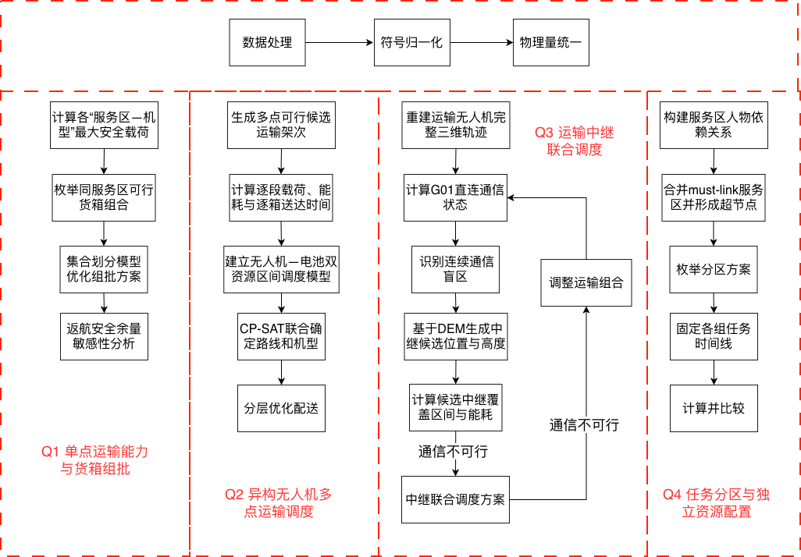

# 2 问题分析

## 2.1 问题一分析

问题一需要解决不同服务区、不同无人机运输机型对应的安全运输能力。山区飞行过程受到 DEM 地形影响，任意两个节点之间的巡航海拔需要根据整条水平航段所经过 DEM 像元的最高地面高程确定，因此即使两个服务区水平距离相近，也可能由于地形高程差异产生不同的爬升高度、飞行时间和能耗。与此同时，无人机能耗还与当前载荷有关，因此最大安全载荷不能简单取无人机额定载质量，而应同时满足额定质量、载舱体积和返航能量余量等要求。

在得到各“服务区—机型”组合的最大安全载荷后，对每个服务区分别枚举满足质量、体积和飞行能量约束的可行货箱组合，将每一个可行组合视为一个候选运输架次，再利用集合划分模型保证所有货箱恰好运输一次。由于无法进行跨服务区组批，可以将大规模货箱组合问题拆分到各服务区内部独立求解，从而显著降低组合规模。

考虑到问题一需要同时评价运输架次数、总能耗和累计作业时间，对该应急运输任务采用分层优化方式，即优先减少运输架次数，再在相同架次数条件下进一步降低能耗和作业时间。最终通过返航安全余量敏感性分析，研究安全要求提高后最大载荷、机型使用和组批结果的变化。

## 2.2 问题二分析

问题二在问题一的基础上放开了“单服务区往返”的限制，使一个运输架次能够连续访问多个服务区。因此需要同时考虑货箱分配、服务区访问顺序、异构无人机选择以及多资源时序调度。考虑为异构多架次车辆路径问题与无人机、电池资源调度问题的耦合。

对于任意候选运输架次，需要按照实际访问顺序逐段计算载荷。随着货箱不断被投送，剩余载荷逐段减少，相应的等效航程、能耗也随之变化；每次到达服务区完成投送后，还需要从服务区作业高度重新爬升。因此不能仅根据总路线距离判断路线是否可行，而应对整个架次进行逐航段物理计算。

在运输路径之外，还需要确定每个架次对应的实体运输无人机、共享电池以及开始时间。共享电池在同机型不同无人机之间可以周转，但不同机型不能混用；飞行结束后的电池需要根据实际 SOC 进行两阶段充电，并在重新投入使用前恢复至 100%。因此同一实体无人机和同一共享电池均具有明显的时间占用区间，适合采用 CP-SAT 的区间调度模型统一表达资源互斥关系。

为控制路径组合规模，首先根据货箱、服务区和机型生成有限数量的可行候选架次，再通过 CP-SAT 在一个模型内联合确定架次选择、具体无人机、电池以及开始时间。目标函数采用分层思想，在所有硬约束满足的前提下，依次降低普通物资逾期、任务完成时间、运输能耗和运输架次数，避免出现固定路线后再发现无人机或电池无法调度的情况。

## 2.3 问题三分析

问题三要求运输无人机在爬升、巡航、下降和物资投送全过程保持连续通信，同时中继无人机自身还受到位置、悬停高度、能源、实体无人机和能源组件周转等约束。

首先需要根据问题二的运输架次重建运输无人机的完整三维轨迹，并按照固定网关 G01 与运输无人机之间的实际三维位置计算通信链路。链路可用性既受到传播距离影响，也受到 DEM 地形遮挡以及双向链路预算限制。只有在 G01 直连不可用时，才需要通过中继无人机建立两段链路，并且运输无人机—中继无人机以及中继无人机—G01 两段链路必须在同一时刻同时可用。

中继悬停位置本质上属于连续二维位置与高度组成的三维搜索空间，如果直接进行连续空间联合优化，模型规模和求解难度会迅速失控。因此首先依据 DEM、运输直连盲区、服务区和关键地形区域生成有限数量的中继候选位置，再设置若干候选离地高度，将连续空间问题转化为有限候选点选择问题。对于每个候选中继方案，预先计算其能够连续覆盖的运输通信区间、服务时段以及中继能源需求，再利用 CP-SAT 完成中继无人机和能源组件调度。

若问题二的运输方案无法获得可行的中继保障，则不能简单宣布无解，而应提取具体通信冲突，对相关运输架次进行局部修改，例如调整开始时间、改变访问顺序、拆分架次或更换候选路线，再重新求解中继任务。由此形成运输调度和中继调度之间的迭代协调过程。

最后对最终方案进行全轨迹通信验证，对飞行阶段边界、通信状态切换以及链路余量较低的区间进行进一步细化，确保全过程不存在通信中断。

## 2.4 问题四分析

问题四主要需要解决将 15 个服务区划分为若干能够独立执行的任务组，并计算每个任务组独立完成固定任务所需要的资源数量。

首先，根据问题三每个运输架次涉及的服务区建立 must-link 关系。同一运输架次涉及的多个服务区必须属于同一任务组，因此可以构造服务区依赖图，并利用并查集将存在直接或传递关联的服务区压缩成若干不可拆分的超节点。

由于服务区总数只有 15 个，在压缩 must-link 连通分量后问题规模进一步减小，可以直接枚举划分为 2 组和 3 组时所有满足约束的非空分区，对每一个分区回放问题三中固定的运输和中继任务时间线，统计各组在每类资源上的最大同时占用数量，从而得到各组独立执行所需的运输无人机、电池、中继无人机和能源组件数量。

最终以资源缺口、资源冗余以及组间工作量均衡为主要评价指标，对两组和三组方案进行比较。如果分组后独立执行所需的资源总量超过当前库存，应如实给出资源缺口，而不能通过修改问题三的任务时间或跨组调度资源消除缺口。

综上所述，建模流程如下图所示。

